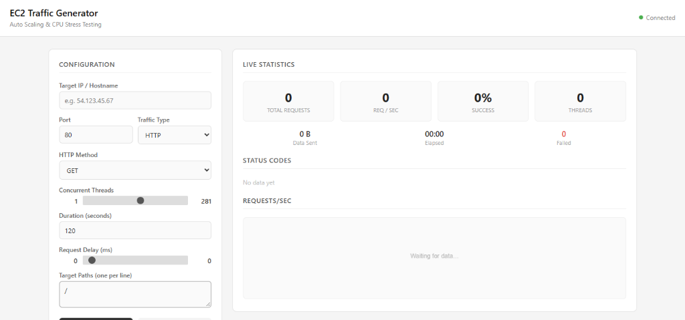

<<<<<<< HEAD
# traffic-generator
=======
# EC2 Traffic Generator

A lightweight, web-based load testing tool built to generate controlled HTTP and TCP traffic against Amazon EC2 instances. It is designed to simulate real-world request patterns, raise CPU utilization, and validate Auto Scaling configurations in AWS environments.

---

## Table of Contents

- [Overview](#overview)
- [Screenshot](#screenshot)
- [Architecture](#architecture)
- [How It Works](#how-it-works)
- [Prerequisites](#prerequisites)
- [Installation](#installation)
- [Usage](#usage)
- [Configuration Reference](#configuration-reference)
- [Auto Scaling Integration](#auto-scaling-integration)
- [Project Structure](#project-structure)
- [Limitations](#limitations)
- [Disclaimer](#disclaimer)
- [License](#license)

---

## Overview

When testing AWS Auto Scaling policies, engineers need a reliable way to drive CPU utilization above the scaling threshold on target EC2 instances. This tool provides a simple browser-based interface to configure and launch multi-threaded traffic against any publicly accessible instance, with live metrics to observe the impact in real time.

Key capabilities:

- Generate concurrent HTTP (GET, POST, HEAD) or raw TCP connections
- Control thread count, request rate, payload size, and duration
- Monitor requests per second, success rate, status codes, and data volume in real time
- Visualize traffic intensity over time through a built-in chart

---

## Screenshot



*The dashboard showing the configuration panel on the left and live statistics on the right.*

---

## Architecture

The system follows a straightforward client-server model. The Flask web server runs locally and serves both the dashboard UI and the REST API. Traffic generation happens server-side using Python threads, each maintaining its own HTTP session or TCP socket to the target.

```
+-------------------+          +---------------------+          +------------------+
|                   |   HTTP   |                     |  HTTP/   |                  |
|   Browser (UI)    +--------->+  Flask App (Local)  +--TCP---->+  EC2 Instance    |
|   localhost:5000  |   API    |  Traffic Engine      |  Traffic |  (Target IP)     |
|                   |<---------+  Stats Collector    |          |                  |
+-------------------+  JSON    +---------------------+          +------------------+
                     responses    N worker threads                  Web Server
                                  (configurable)                   (Apache/Nginx)
```

### Component Breakdown

| Component          | Technology       | Responsibility                                    |
|--------------------|------------------|---------------------------------------------------|
| Web UI             | HTML, CSS, JS    | Configuration form, live stats display, chart     |
| Web Server         | Flask (Python)   | Serves UI, exposes REST API endpoints             |
| Traffic Engine     | Python threading | Spawns worker threads, manages HTTP/TCP sessions  |
| Stats Collector    | Python dataclass | Thread-safe aggregation of request metrics        |

---

## How It Works

The workflow proceeds through four distinct phases:

### Phase 1 -- Configuration

The user opens the dashboard at `http://localhost:5000` and fills in the target parameters: IP address, port, traffic type, thread count, duration, and optional settings such as payload size and request delay.

### Phase 2 -- Traffic Generation

Upon clicking Start, the browser sends a POST request to `/api/start` with the configuration payload. The Flask backend instantiates the configured number of worker threads. Each thread enters a loop:

1. Build the request URL from the target IP, port, and a randomly selected path.
2. Attach randomized headers (User-Agent, cache-busting query parameters).
3. Send the HTTP request (or open a TCP socket and transmit a payload).
4. Record the outcome (success/failure, status code, bytes sent) in the shared stats collector.
5. Wait for the configured delay (if any), then repeat until the duration expires or the user clicks Stop.

### Phase 3 -- Monitoring

While traffic is running, the browser polls the `/api/stats` endpoint every second. The response includes total requests, requests per second, success rate, active thread count, data volume, elapsed time, and a breakdown of HTTP status codes. The dashboard renders these values and appends each data point to the live chart.

### Phase 4 -- Completion

When the duration expires or the user stops generation manually, all worker threads exit. The final stats snapshot is delivered to the dashboard, and the UI resets to its idle state.

```
    CONFIGURE            GENERATE             MONITOR             COMPLETE
  +------------+     +--------------+     +---------------+     +------------+
  |            |     |              |     |               |     |            |
  | User fills | --> | N threads    | --> | Browser polls | --> | Threads    |
  | in target  |     | send requests|     | /api/stats    |     | exit, UI   |
  | parameters |     | concurrently |     | every 1 sec   |     | resets     |
  |            |     |              |     |               |     |            |
  +------------+     +--------------+     +---------------+     +------------+
                           |                     |
                           v                     v
                     EC2 CPU rises         Dashboard updates
                     CloudWatch alarm      chart and counters
                     triggers scaling
```

### Request Flow Detail

```
  Worker Thread (1 of N)
  |
  |-- Build URL: http://<target_ip>:<port>/<random_path>?_=<timestamp>&r=<rand>
  |-- Set headers: random User-Agent, Accept, Cache-Control: no-cache
  |-- Send request (GET/POST/HEAD) with 10s timeout, SSL verification disabled
  |-- Record result in thread-safe stats collector
  |-- Sleep for configured delay (ms)
  |-- Repeat until duration expires or stop signal received
```

---

## Prerequisites

- Python 3.8 or higher
- pip (Python package manager)
- A running EC2 instance with a web server (Apache, Nginx, or any HTTP listener)
- The EC2 security group must allow inbound traffic on the target port from your IP

---

## Installation

1. Clone or download this repository.

2. Install the Python dependencies:

```bash
pip install -r requirements.txt
```

The only dependencies are `flask` and `requests`. No compiled extensions or platform-specific packages are required.

---

## Usage

1. Start the application:

```bash
python app.py
```

2. Open a browser and navigate to:

```
http://localhost:5000
```

3. Enter your EC2 instance's public IP address, configure the desired parameters, and click **Start**.

4. Observe the live statistics panel as traffic flows to the target. Click **Stop** at any time to halt generation.

---

## Configuration Reference

| Parameter         | Description                                           | Default | Range       |
|-------------------|-------------------------------------------------------|---------|-------------|
| Target IP         | Public IP or hostname of the EC2 instance             | --      | --          |
| Port              | Target port number                                    | 80      | 1 -- 65535  |
| Traffic Type      | Protocol to use: HTTP or TCP                          | HTTP    | --          |
| HTTP Method       | Request method (only for HTTP type)                   | GET     | GET, POST, HEAD |
| Concurrent Threads| Number of parallel worker threads                     | 50      | 1 -- 500    |
| Duration          | How long to run, in seconds                           | 120     | 1 -- 3600   |
| Payload Size      | Size of POST body or TCP payload, in kilobytes        | 5       | 1 -- 100    |
| Request Delay     | Pause between consecutive requests per thread, in ms  | 0       | 0 -- 1000   |
| Target Paths      | URL paths to rotate through (one per line, HTTP only) | /       | --          |

---

## Auto Scaling Integration

This tool is purpose-built to validate Auto Scaling configurations. The typical testing workflow is:

### Step 1 -- Prepare the Auto Scaling Group

Create an Auto Scaling Group with a Launch Template, setting the minimum capacity to 1 and the maximum to your desired upper bound (e.g., 3 or 5).

### Step 2 -- Define a Scaling Policy

Add a Target Tracking Scaling Policy using the `CPUUtilization` metric. Set the target value to your intended threshold (commonly 50 percent).

### Step 3 -- Run the Traffic Generator

Configure this tool with 100 to 200 concurrent threads, 0 ms delay, and a duration of at least 300 seconds. This typically pushes CPU utilization above most thresholds within 1 to 2 minutes.

### Step 4 -- Observe Scaling Activity

Monitor the Auto Scaling Group's activity history in the AWS Console. CloudWatch evaluates the CPU metric over a default period of 60 seconds, and the scaling action usually triggers within 2 to 5 minutes of sustained load.

### Recommended Settings for Auto Scaling Tests

| Scenario                  | Threads | Delay | Duration | Method |
|---------------------------|---------|-------|----------|--------|
| Light load (baseline)     | 10      | 100   | 120      | GET    |
| Moderate load             | 50      | 0     | 180      | GET    |
| Trigger scaling (50% CPU) | 150     | 0     | 300      | GET    |
| Heavy stress test         | 300     | 0     | 600      | POST   |

---

## Project Structure

```
traffic-generator/
|-- app.py                  Flask web application and REST API
|-- traffic_engine.py       Multi-threaded traffic generation engine
|-- requirements.txt        Python dependencies (flask, requests)
|-- README.md               This file
|-- docs/
|   |-- screenshot.png      Application screenshot
|-- templates/
    |-- index.html          Web dashboard (HTML, CSS, JavaScript)
```

---

## Limitations

- This tool runs on a single machine. The maximum throughput is bounded by your local CPU, memory, and network bandwidth.
- Python's GIL limits true parallelism for CPU-bound work, though HTTP I/O is largely network-bound and scales well with threads.
- The tool does not support distributed load generation across multiple machines.
- HTTPS targets use unverified SSL connections (certificate validation is disabled).
- There is no authentication on the local web interface. Do not expose port 5000 to untrusted networks.

---

## Disclaimer

This tool is intended exclusively for testing infrastructure that you own or have explicit written authorization to test. Generating unsolicited traffic against systems without permission may violate computer fraud and abuse laws in your jurisdiction. The authors assume no liability for misuse.

---

## License

MIT License. See the source files for details.
>>>>>>> f7068da (initial commit)
